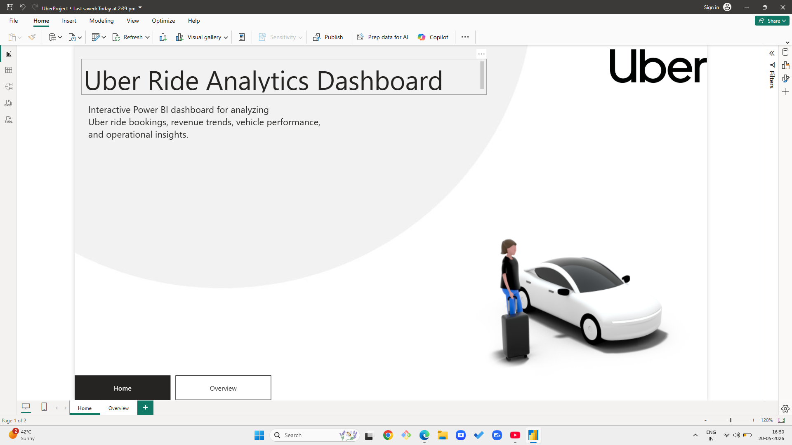
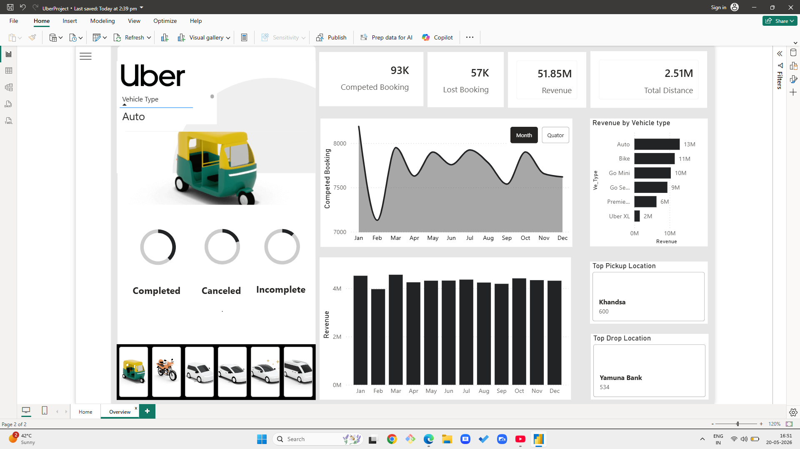

🚖 Uber Ride Analytics Dashboard

An interactive Power BI dashboard built to analyze Uber ride bookings, revenue trends, vehicle performance, and operational insights.

📊 Dashboard Features
Interactive homepage with navigation
Vehicle-wise filtering
Monthly revenue analysis
Monthly booking trends
Revenue by vehicle type
Top pickup locations
Top drop locations
Ride status analysis
KPI cards and operational insights

📈 Key Insights
Auto and Bike categories generated high revenue compared to premium vehicle types.
Ride bookings remained relatively stable throughout the year with noticeable monthly fluctuations.
Certain pickup and drop locations showed consistently high ride demand.
Completed rides formed the majority of bookings, while cancelled and incomplete rides highlighted operational issues.
Revenue trends helped identify peak-performing months and vehicle categories.

🛠️ Technologies Used
Power BI
DAX
Power Query
Data Visualization
Dashboard Design

📷 Dashboard Preview
Homepage

Overview Dashboard

📂 Project Files
Uber-PowerBI-Dashboard/
│
├── Uber_Dashboard.pbix
├── README.md
├── screenshots/
│   ├── homepage.png
│   └── overview.png
